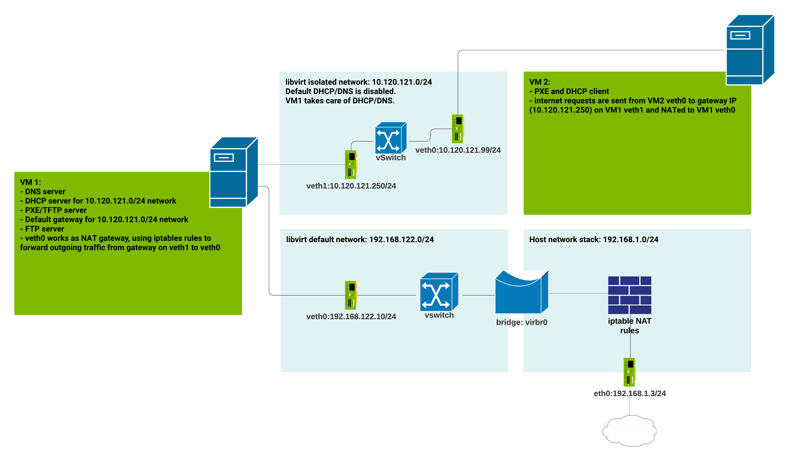

# KVM: set up guest as DNS, DHCP, TFTP servers
By default `libvirt` daemon uses `dnsmasq` on host machine to provide DNS and DHCP services to guests. One example is the `default`network.   
We can set up a dedicated guest VM to serve these services instead. We can then extend this guest VM to serve other services like PXE, FTP, etc.   
In this doc, we will use dnsmasq to provide DNS, DHCP, and TFTP traffic.
## Network diagram

## Prerequisites
- Make sure VM1 with name `dhcp-server` was already created. Read [README.md](README.md) for information about running a Fedora Cloud machine.
## Set up libvirt network
libvirt already provides the `default` network
```bash
$ virsh net-list
 Name              State    Autostart   Persistent
----------------------------------------------------
 default           active   yes         yes
```

```bash
$ virsh net-dumpxml default 
<network>
  <name>default</name>
  <uuid>4699892c-c4d8-4331-a380-02881cb07cba</uuid>
  <forward mode='nat'>
    <nat>
      <port start='1024' end='65535'/>
    </nat>
  </forward>
  <bridge name='virbr0' stp='on' delay='0'/>
  <mac address='52:54:00:49:00:15'/>
  <ip address='192.168.122.1' netmask='255.255.255.0'>
    <dhcp>
      <range start='192.168.122.2' end='192.168.122.254'/>
      <host mac='52:54:00:e1:b6:90' name='dhcp-server' ip='192.168.122.10'/>
    </dhcp>
  </ip>
</network>
```
Here we updated the network settings to provide static IP to a MAC address on our VM1 (`dhcp-server`) machine using `virsh net-edit default`.
```bash
$ virsh domiflist dhcp-server 
 Interface   Type      Source    Model    MAC
-------------------------------------------------------------
 -           network   default   virtio   52:54:00:e1:b6:90
 $ virsh net-edit default
 # Need to restart default network to have the new update taken effect
 $ virsh net-destroy default
 $ virsh net-start default
```
Create a new isolated network. Note that we do not enable default DHCP by libvirt
```bash
$ cat <<EOF > isolated-dhcp-network.xml 
<network>
  <name>isolated-dhcp</name>
  <uuid>34c07436-c91c-451a-9fed-06417ddd1adc</uuid>
  <bridge name="virbr5" stp="on" delay="0"/>
  <mac address="52:54:00:90:25:bb"/>
  <ip address="10.120.121.1" netmask="255.255.255.0">
  </ip>
</network>
EOF
$ virsh net-create --file isolated-dhcp-network.xml 
Network isolated-dhcp created from isolated-dhcp-network.xml
```
Create a new network interface on `dhcp-server` VM and use `isolated-dhcp` network
```bash
$ virsh attach-interface --domain dhcp-server --type network \
--source isolated-dhcp --model virtio \
--mac 52:54:00:4b:73:5f --config
$ virsh domiflist dhcp-server 
 Interface   Type      Source          Model    MAC
-------------------------------------------------------------------
 -           network   default         virtio   52:54:00:e1:b6:90
 -           network   isolated-dhcp   virtio   52:54:00:4b:73:5f
```
We are ready to set up `dnsmasq`. Let's start `dhcp-server` machine
```bash
$ virsh start dhcp-server 
Domain dhcp-server started
$ ssh mpham@192.168.122.10
```
## Set up dnsmasq as DNS, DHCP, TFTP, and Gateway server
To use VM1 as a gateway for the whole network, we need to enable IP forwarding to forward/route IP packet traffic
```bash
$ sysctl net.ipv4.ip_forward
net.ipv4.ip_forward = 0
$ echo "net.ipv4.ip_forward=1" | sudo tee /etc/sysctl.conf
$ sudo sysctl -p /etc/sysctl.conf
```
We would need to use `nmcli` to modify the connections on `eth0` (using `default` network) and `eth1` (using `isolated-dhcp` network) so that `dnsmasq` can work properly on VM1.   
First get the 2 connection names.
```bash
$ DEFAULT_CONN=$(nmcli -t -f general.connection -e yes -m tab dev show eth0)
$ ISOLATED_DHCP_CONN=$(nmcli -t -f general.connection -e yes -m tab dev show eth1)
```
Disable default dns service provided by libvirt on default network connection. We will use `dnsmasq` as the dns server and forward the lookup to the upstream dns server on `192.168.122.1`. 
```bash
$ sudo nmcli con mod "$DEFAULT_CONN" ipv4.ignore-auto-dns yes
#auto connected by NetworkManager
$ sudo nmcli con mod "$DEFAULT_CONN" connection.autoconnect yes
$ sudo systemctl restart NetworkManager
```
The next step is to set the internal (isolated-dhcp) network to use the static IP `10.120.121.250` for both IP and DNS server.
```bash
$ sudo nmcli con mod "$ISOLATED_DHCP_CONN" ipv4.dns "10.120.121.250"
$ sudo nmcli con mod "$ISOLATED_DHCP_CONN" ipv4.address "10.120.121.250/24"
$ sudo nmcli con mod "$ISOLATED_DHCP_CONN" ipv4.dns-search "example.com"
$ sudo nmcli con mod "$ISOLATED_DHCP_CONN" connection.autoconnect yes
$ sudo nmcli con mod "$ISOLATED_DHCP_CONN" ipv4.method manual
$ sudo nmcli con up "$ISOLATED_DHCP_CONN"
```
Disable systemd-resolved so it does not interfere with dnsmasq 
```bash
$ sudo systemctl disable systemd-resolved
$ sudo systemctl stop systemd-resolved
```
Use default DNS settings for `NetworkManager`. This allows `NetworkManager` to add name servers from all connections to `/etc/resolv.conf`

```bash
$ sudo sed -i '/\[main\]/a dns=default' /etc/NetworkManager/NetworkManager.conf
$ sudo systemctl restart NetworkManager
$ cat /etc/resolv.conf 
# Generated by NetworkManager
search example.com
nameserver 10.120.121.250
```
If we try resolving a domain now using a tool like `dig` or `nslookup` we will get lookup timeout due to no dns server running on `10.120.121.250`.   

Install `dnsmasq` on VM1 and configure it to bind dns/dhcp/gateway/tftp services to the `isolated-dhcp` network.
**Note: since dns service is not yet available, we may need to manually add nameserver, e.g 8.8.8.8 to `/etc/resolved.cfg` to install packages. This entry will be deleted once we restart `NetworkManager`. 

```bash
$ echo "nameserver 8.8.8.8"|sudo tee /etc/resolv.conf  
$ sudo dnf install -y dnsmasq
$ cat <<EOF | sudo tee /etc/dnsmasq.d/isolated-dhcp.conf
# Set this to listen on the internal interface
listen-address=::1,127.0.0.1,10.120.121.250
interface=eth1

# This is the domain the cluster will be on
# expand-hosts addsthe domain to host entries in /etc/hosts
expand-hosts
domain=example.com

# The 'upstream' libvirt dns server running on default network
server=192.168.122.1

# Add local-only domains here, queries in these domains are answered
# from /etc/hosts or DHCP only.
local=/example.com/

# SET UP DHCP
dhcp-range=10.120.121.5,10.120.121.250,12h
dhcp-leasefile=/var/lib/dnsmasq/dnsmasq.leases
# dhcp option 3 is the router
dhcp-option=3,10.120.121.250
# dhcp option 6 is the DNS server
dhcp-option=6,10.120.121.250
# dhcp option 28 is the broadcast address
dhcp-option=28,10.120.121.255

# The set is required for tagging. Set a mac address with a specific tag
# this is for dhcp server which provide other services. MAC is for veth1
dhcp-mac=set:services,52:54:00:4b:73:5f
#this is for pxe client (VM2) machine
dhcp-mac=set:pxeclient,52:54:00:82:ba:39

# Match the tag with a specific hostname
# dhcp option 12 is the hostname to hand out to clients
dhcp-option=tag:pxe_client,12,pxeclient.example.com
dhcp-option=tag:services,12,services.example.com

# hand out IP addresses
dhcp-host=52:54:00:4b:73:5f,10.120.121.250
dhcp-host=52:54:00:82:ba:39,10.120.121.99

# Add A, AAAA and PTR records to the DNS
# both dhcp and services will be resolved to 10.120.121.250
host-record=dhcp,dhcp.example.com,services,services.example.com,10.120.121.250
#this is also resolved as client.example.com
host-record=client,centos,10.120.121.99

# PXE
#PXELINUX is a Syslinux derivative, for booting 
# from a network server using a network ROM conforming to the Intel PXE
#pxelinux.0: BIOS-based PXE clients
#grubx64.efi: UEFI-based PXE clients
# specify tftp server name (pxeserver) and server address (10.120.121.250)
#dhcp-boot=pxelinux.0,pxeserver,10.120.121.250
#if enable-tftp is set, no need to provide other server info
dhcp-boot=pxelinux.0

#PXE client will see the prompt 
pxe-prompt="Press F8 for menu.", 60
#use pxelinux for x86PC platform
pxe-service=x86PC, "PXEBoot Server", pxelinux
#enable tftp server with dnsmasq
enable-tftp
#the location for all netbooting files.
tftp-root=/var/lib/tftpboot
EOF
```
## Set up TFTP
Since PXELINUX is a Syslinux derivative, which is a lightweight master boot record boot loaders for starting up IBM PC compatible computers with the Linux kernel over the PXE channel. We will use `syslinux` bootloader package for our pxelinux setup. Since our pxe root is at `/var/lib/tftpboot`, copy all syslinux boot files into this location.   
We also need to install `tftp-server` package to provide tftp support. This package will create the tftp root at `/var/lib/tftpboot` and provide appropriate `selinux` configurations. I got the `permission denied` from a client trying to access tftp data when not using this package by default(read [here](https://unix.stackexchange.com/questions/31809/permission-denied-trying-to-get-a-file-using-tftp#comment43218_31809) for more info).
```bash
$ sudo dnf install -y syslinux
$ ls /usr/share/syslinux
altmbr.bin    cpuidtest.c32  gfxboot.c32   ifplop.c32          ldlinux.c32   mboot.c32     prdhcp.c32      syslinux.com
...
$ sudo dnf install -y tftp-server
$ sudo cp -r /usr/share/syslinux/* /var/lib/tftpboot
# run this in case there is permission denied issue
$ sudo restorecon -Rv /var/lib/tftpboot
```
The PXE Server maps the configuration boot file to a client machine from a group of specific files in <tftp_root>/pxelinux.cfg folder(read [pxelinux configuration](https://wiki.syslinux.org/wiki/index.php?title=PXELINUX#Configuration)). The order of the mapping search is client `UUID > MAC > IP address > default file`. In this example we will use a default file to boot our client with CentOS 7 image.
```bash
$ sudo mkdir -p /var/lib/tftpboot/pxelinux.cfg
$ cat <<EOF | sudo tee /var/lib/tftpboot/pxelinux.cfg/default
default menu.c32
prompt 0
timeout 300
ONTIMEOUT local

menu title ########## PXE Boot Menu ##########

label 1
menu label ^1) Install CentOS 7 x64 with Local Repo
kernel centos7/vmlinuz
append initrd=centos7/initrd.img method=ftp://services.example.com/pub devfs=nomount

label 2
menu label ^4) Boot from local drive
EOF
```
Have the CenOS iso image ready. From the `default` configuration file above we will need to have `centos7` directory to be created at the tftp root, with the 2 files `vmlinuz` and `initrd.img` copied over from the centos7 image.
```bash
$ ls
centos-dvd.iso
$ sudo mount -o loop centos-dvd.iso /mnt
$ sudo mkdir -p /var/lib/tftpboot/centos7
$ sudo cp /mnt/images/pxeboot/vmlinuz /mnt/images/pxeboot/initrd.img  /var/lib/tftpboot/centos7
```
Also notice we will use FTP as a method to host CentOS image files to be provided to the PXE client. PXE can support other methods like HTTP/HTTPS or NFS.   
Install `vsftpd` package and copy all the centos image files to the ftp public folder. We also need to enable anonymous access to this folder.
```bash
$ sudo dnf install -y vsftpd
$ sudo cp -r /mnt/*  /var/ftp/pub/ 
$ sudo chmod -R 755 /var/ftp/pub
$ sudo sed -i 's/anonymous_enable=NO/anonymous_enable=YES/g' /etc/vsftpd/vsftpd.conf
```
Enable and start `dnsmasq` and `vsftpd`
```bash
$ sudo systemctl enable dnsmasq
$ sudo systemctl start dnsmasq
$ sudo systemctl enable vsftpd
$ sudo systemctl start vsftpd
```
We can test connection to ftp server using `ftp` package. Log in as `ftp` user with `blank` password for anonymous access. Also make sure the server `/pub` location has all the Centos installations files.
```bash
$ sudo dnf install -y ftp
$ ftp -p services.example.com
Connected to services.example.com (10.120.121.250).
220 (vsFTPd 3.0.3)
Name (services.example.com:mpham): ftp
331 Please specify the password.
Password:
230 Login successful.
Remote system type is UNIX.
Using binary mode to transfer files.
ftp> ls pub
227 Entering Passive Mode (10,120,121,250,244,22).
150 Here comes the directory listing.
-rwxr-xr-x    1 0        0              14 May 19 17:26 CentOS_BuildTag
...
```
We are ready to create a TFTP client
## Set up TFTP client
The dnsmasq configuration file specifies `52:54:00:82:ba:39` as MAC, `10.120.121.99` as IP, and `client.example.com` and `centos.example.com`.   

We will use `virsh` command to create a new empty VM that uses PXE boot and `52:54:00:82:ba:39` as NIC and connect it to the `isolated-dhcp` network. This can be run on the host machine.
```bash
$ sudo qemu-img create -f qcow2 -o preallocation=metadata /var/lib/libvirt/images/centos7.0.qcow2 10G
$ virt-install --connect qemu:///system --name centos7_client --network network=isolated-dhcp --mac=52:54:00:82:ba:39 --pxe --ram=2048 --vcpus=2 --check-cpu --os-type=linux --os-variant=generic --disk path=/var/lib/libvirt/images/centos7.0.qcow2
```
The `virt-install` will run a `virt-viewer` session for the installation in graphic mode.   
**Note: From [fedora doc](https://docs.fedoraproject.org/en-US/Fedora_Draft_Documentation/0.1/html/Virtualization_Deployment_and_Administration_Guide/sect-Virtualization_Host_Configuration_and_Guest_Installation_Guide-Guest_Installation-Installing_guests_with_PXE.html):
```
Note that the command above cannot be executed in a text-only environment. A fully-virtualized (--hvm) guest can only be installed in a text-only environment if the --location and --extra-args "console=console_type" are provided instead of the --graphics spice parameter.
```
After the installation we can ssh to the client VM
```bash
$ ssh mpham@10.120.121.99
$ ping services.example.com
PING services.example.com (10.120.121.250) 56(84) bytes of data.
64 bytes from dhcp (10.120.121.250): icmp_seq=1 ttl=64 time=0.593 ms
...
$ ping client.example.com
PING client.example.com (10.120.121.99) 56(84) bytes of data.
64 bytes from client (10.120.121.99): icmp_seq=1 ttl=64 time=0.040 ms
...
$ ping google.com
PING google.com (172.217.4.78) 56(84) bytes of data.
From 10.120.121.1 (10.120.121.1) icmp_seq=1 Destination Port Unreachable
...
```
From the output above, we see that the client cannot connect to any servers outside of our `isolated-dhcp` network. We would need to forward all traffic from our gateway at `10.120.121.250` on VM1 `eth1` to VM1 `eth0`.
## Set up NAT gateway for internet access
On VM1 machine, we will use `eth0` as NAT gateway for all outside traffic coming from `isolated-dhcp` with gateway on `eth1`.
```bash
# make sure ip forwarding is enabled
$ sysctl net.ipv4.ip_forward
net.ipv4.ip_forward = 1
# install iptables-services to persist iptables rules
$ sudo dnf install -y iptables-services
$ sudo systemctl enable iptables
$ sudo iptables -A FORWARD -i eth1 -o eth0 -j ACCEPT
$ sudo iptables -A FORWARD -i eth0 -o eth1 -m state --state ESTABLISHED,RELATED -j ACCEPT
$ sudo iptables -t nat -A POSTROUTING -o eth0 -j MASQUERADE
$ sudo service iptables save
```
Now, go back to VM2 and ping any server on the internet. We should expect to receive the responses
```bash
$ ping google.com
PING google.com (172.217.4.78) 56(84) bytes of data.
64 bytes from lga15s47-in-f78.1e100.net (172.217.4.78): icmp_seq=1 ttl=54 time=76.9 ms
...
```
## Install Fedora CoreOS using PXE and HTTP
In this example, we will create a [Fedora CoreOS](https://getfedora.org/coreos/download?tab=metal_virtualized&stream=stable) client with `52:54:00:82:ba:40` as MAC, `10.120.121.100` as IP, and `fedora-coreos.example.com` as hostname.   

On VM1, make sure we have the kernel and initramfs image ready.
```bash
$ ls
fedora-coreos-31.20200420.3.0-live-initramfs.x86_64.img  fedora-coreos-31.20200420.3.0-live-kernel-x86_64
$ sudo mkdir -p /var/lib/tftpboot/fedcoreos
$ sudo mv fedora-coreos-31.20200420.3.0-live-* /var/lib/tftpboot/fedora_coreos/
$ sudo ln -s /var/lib/tftpboot/fedcoreos/fedora-coreos-31.20200420.3.0-live-kernel-x86_64 /var/lib/tftpboot/fedcoreos/fedora-coreos-kernel
$ sudo ln -s /var/lib/tftpboot/fedcoreos/fedora-coreos-31.20200420.3.0-live-initramfs.x86_64.img /var/lib/tftpboot/fedcoreos/fedora-coreos-initramfs.img
# need to restore the tftpboot for selinux to allow new files
$ sudo restorecon -r /var/lib/tftpboot/
```
Instead of using the PXE `default` configuration file for the client VM, we will use the client MAC address for configuration file mapping. Note that the file name should be `01-<mac seperated with '-'>`
```bash
$ cat <<EOF | sudo tee /var/lib/tftpboot/pxelinux.cfg/01-52-54-00-82-ba-40
DEFAULT pxeboot
TIMEOUT 20
PROMPT 0
LABEL pxeboot
    KERNEL fedcoreos/fedora-coreos-kernel
    APPEND ip=dhcp rd.neednet=1 initrd=fedcoreos/fedora-coreos-initramfs.img console=tty0 console=ttyS0 coreos.inst.install_dev=/dev/sda coreos.inst.stream=stable coreos.inst.ignition_url=http://services.example.com:8080/fedora-coreos/config.ign
IPAPPEND 2
EOF
$ ls /var/lib/tftpboot/pxelinux.cfg/
01-52-54-00-82-ba-40  default
```
We also need to create the ignition file `config.ign`
```bash
$ cat <<EOF > config.fcc
variant: fcos
version: 1.0.0
passwd:
  users:
    - name: core
      ssh_authorized_keys:
        - ssh-rsa AAA...
EOF
$ sudo dnf install -y fcct
$ fcct --strict config.fcc --output config.ign
$ sudo dnf install -y httpd
$ sudo sed -i s/'Listen 80'/'Listen 8080'/g /etc/httpd/conf/httpd.conf
$ sudo mkdir -p /var/www/html/fedora-coreos
# make sure we have the fedora raw file
$ ls
config.ign  fedora-coreos-31.20200420.3.0-metal.x86_64.raw.xz fedora-coreos-31.20200420.3.0-metal.x86_64.raw.xz.sig
$ sudo mv config.ign fedora-coreos-31.20200420.3.0-metal.x86_64.raw.xz fedora-coreos-31.20200420.3.0-metal.x86_64.raw.xz.sig /var/www/html/fedora-coreos
$ sudo ln -s /var/www/html/fedora-coreos/fedora-coreos-31.20200420.3.0-metal.x86_64.raw.xz /var/www/html/fedora-coreos/fedora-coreos-metal.raw.xz
$ sudo ln -s /var/www/html/fedora-coreos/fedora-coreos-31.20200420.3.0-metal.x86_64.raw.xz.sig fedora-coreos-metal.raw.xz.sig

$ sudo chown -R apache. /var/www/html/*
$ sudo restorecon -r /var/www/html
# test retrieving files
$ curl services.example.com:8080/fedora-coreos/config.ign
```
Set up dnsmasq
```bash
$ cat <<EOF |sudo tee --append /etc/dnsmasq.d/isolated-dhcp.conf
dhcp-mac=set:fedoracoreos,52:54:00:82:ba:40
dhcp-host=52:54:00:82:ba:40,10.120.121.100
dhcp-option=tag:fedoracoreos,12,fedora-coreos.example.com
host-record=fedora-coreos,fedora-coreos.example.com,10.120.121.100
EOF
$ sudo systemctl restart dnsmasq.service
```
Create a new PXE client that will run Fedora Core OS
```bash
$ sudo qemu-img create -f qcow2 -o preallocation=metadata /var/lib/libvirt/images/fedcoreos.qcow2 10G
$ virt-install --connect qemu:///system --name fedora-coreos --network network=isolated-dhcp --mac=52:54:00:82:ba:40 --pxe --ram=4000 --vcpus=2 --check-cpu --os-type=linux --os-variant=generic --disk path=/var/lib/libvirt/images/fedcoreos.qcow2
$ ssh core@10.120.121.100
[core@fedora-coreos ~]$ ping fedora-coreos
PING fedora-coreos.example.com (10.120.121.100) 56(84) bytes of data.
64 bytes from fedora-coreos (10.120.121.100): icmp_seq=1 ttl=64 time=0.051 ms
...
```


## References
- [VirtualNetworking](https://wiki.libvirt.org/page/VirtualNetworking)
- [iptables forwarding between two interface
](https://serverfault.com/questions/431593/iptables-forwarding-between-two-interface)
- [Setting up a ‘PXE Network Boot Server’ for Multiple Linux Distribution Installations in RHEL/CentOS 7](https://www.tecmint.com/install-pxe-network-boot-server-in-centos-7/)
- [Using network namespaces and a virtual switch to isolate servers](https://ops.tips/blog/using-network-namespaces-and-bridge-to-isolate-servers/)
- [Network Namespace , connect to host and with a VM](https://github.com/sjha3/Linux-Networking/wiki/5.-Network-Namespace-,-connect-to-host-and-with-a-VM)
- [Using network namespaces with veth to NAT guests with overlapping IPs](https://blog.christophersmart.com/2020/03/15/using-network-namespaces-with-veth-to-nat-guests-with-overlapping-ips/)
- [DD-WRT: DNSMasq expand-hosts not working](https://superuser.com/questions/111766/dd-wrt-dnsmasq-expand-hosts-not-working)
- [dnsmasq](https://wiki.archlinux.org/index.php/dnsmasq#PXE_server)
- [PXELINUX](https://wiki.syslinux.org/wiki/index.php?title=PXELINUX)
- [How To Set Up vsftpd for Anonymous Downloads on Ubuntu 16.04](https://www.digitalocean.com/community/tutorials/how-to-set-up-vsftpd-for-anonymous-downloads-on-ubuntu-16-04)
- [“Permission denied” trying to get a file using TFTP](https://unix.stackexchange.com/questions/31809/permission-denied-trying-to-get-a-file-using-tftp#comment43218_31809)
- [Installing guest virtual machines with PXE](https://docs.fedoraproject.org/en-US/Fedora_Draft_Documentation/0.1/html/Virtualization_Deployment_and_Administration_Guide/sect-Virtualization_Host_Configuration_and_Guest_Installation_Guide-Guest_Installation-Installing_guests_with_PXE.html)
- [iptables forwarding between two interface](https://serverfault.com/questions/431593/iptables-forwarding-between-two-interface)
- [Fedora CoreOS PXE Installation](https://docs.fedoraproject.org/en-US/fedora-coreos/bare-metal/#_installing_from_pxe)
- [Fedora CoreOS - Producing an Ignition File](https://docs.fedoraproject.org/en-US/fedora-coreos/producing-ign/)